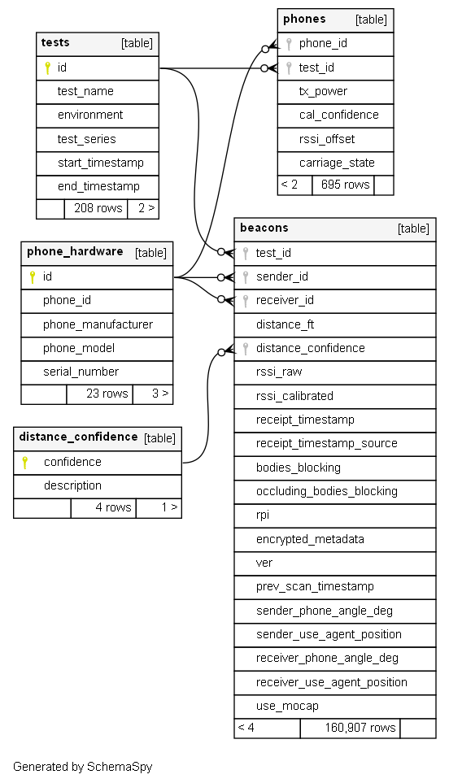

# pact_beacons
Contains beacons dataset, documentation on [testing](docs/test_information.md) and [beacon collection methods](docs/beacon_dataset_methods.md), and instructions for install and use.

PostgreSQL databases can be exported (dumped) and imported (restored) to reproduce the database on a new host. The full documentation for this process can be found here: https://www.postgresql.org/docs/9.1/backup.html

This repo contains the file *beacons.dump*, which contains the serialized PACT beacons Postgres database. Restore this database using the instructions below to set up your own instance of the PACT Beacons database.

You can also view the contents of the database in csv format under /csv/. These files were created through export of the Postgres database. **It is recommended to use the restored Postgres database for analysis, as relations are not preserved through the export process.**


## Installation

The beacons dataset can be installed using psql at the command line interface.

1. Install the PostgreSQL server 
    - Installation available at https://www.postgresql.org/download/
    - Add the installation location to your system path.
    
2. Create a new empty database (here, named **beacons_restored**)
    - PSQL docs: https://www.postgresql.org/docs/9.0/sql-createdatabase.html 
    - From command line: `createdb -U <username> -T template0 beacons_restored`
    - *Note: restoring a database requires an existing, "clean" database.* **template0** *is a pre-installed empty database that is used as a template*
    
3. Add the data from the dump file to the empty database by restoring the database
    - From command line: `psql -U <username> -d beacons_restored -f <path to>beacons.dump`
    
4. Confirm that the database was installed with all of the beacons (optional):
    - Log into the psql environment: `psql -U <username>`
    - Connect to the newly created database: 
        ```console
        postgres=# \c beacons_restored
        ```
    - Take an exact count of the rows in the ***beacons*** table:
        ```console
        beacons_restored=# select count(*) as exact_count from beacons;
        ```
    - Confirm output:
        ```console
        exact_count
        -------------
        160907
        (1 row)
        ```


## Using the Database

Once restored, this database contains 5 tables and a number of relations between the tables. The tables are:

- ***beacons***
  - Information about individual beacons sent between sending and receiving phones during tests.
  - Includes RSSI and Distance columns.
- ***distance_confidence***
  - Detailed descriptions of distance confidence codes.
- ***phone_hardware***
  - Information about phones including manufacturer and model name.
- ***phones***
  - Test-specific information about the phones, including carriage state and transmitter power.
- ***tests***
  - Information about the tests used to collect beacons.

The relations between the tables are summarized in the following schema diagram:




For more information on this dataset, please contact Keegan Quigley (keegan.quigley@ll.mit.edu) or Curran Schiefelbein (curran.schiefelbein@ll.mit.edu).

## Distribution Statement
DISTRIBUTION STATEMENT A. Approved for public release. Distribution is unlimited.

This material is based upon work supported under Air Force Contract No. FA8702-15-D-0001. Any opinions, findings, conclusions or recommendations expressed in this material are those of the author(s) and do not necessarily reflect the views of the U.S. Air Force.

© 2021 Massachusetts Institute of Technology.

Delivered to the U.S. Government with Unlimited Rights, as defined in DFARS Part 252.227-7013 or 7014 (Feb 2014). Notwithstanding any copyright notice, U.S. Government rights in this work are defined by DFARS 252.227-7013 or DFARS 252.227-7014 as detailed above. Use of this work other than as specifically authorized by the U.S. Government may violate any copyrights that exist in this work.
