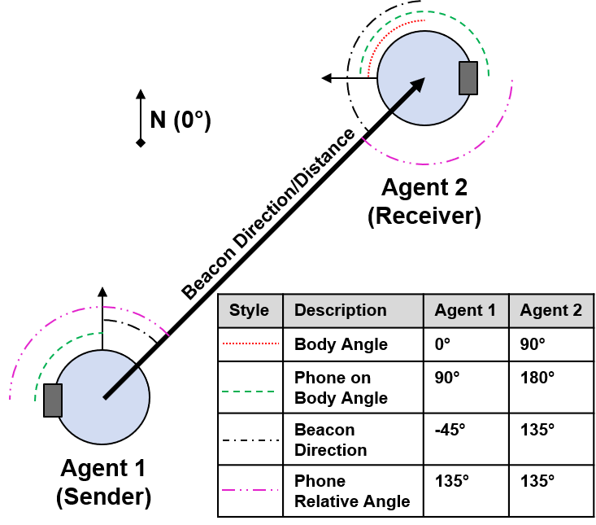
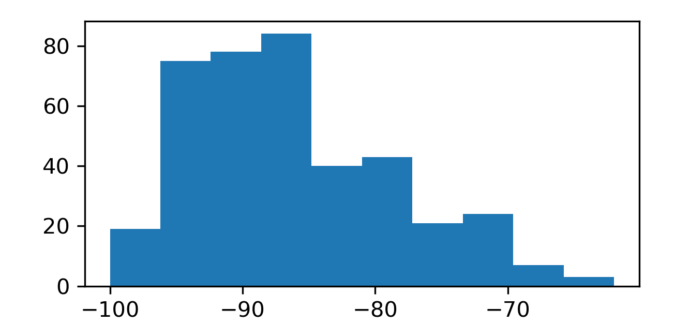

# MIT-LL Beacons Dataset Methodology

## Introduction

This dataset of beacons, or transmissions between a sending and receiving phone running Exposure Notification Services (ENS), is meant to provide a tool for studying the path loss of the Bluetooth signal under certain conditions and its utility as a proxy for exposure levels.

These beacons were collected during two series of tests at MIT Lincoln Laboratory. The first series of tests, referred to in this document as the "MITLL" Tests, were conducted in the Autonomous Systems Development Facility (ASDF) at MITLL, from September to December 2020. This series of tests involved a small number of phones in static positions. The second series of tests, referred to as "MITLL_UA" Tests, or University of Arizona Tests, was conducted between February and March of 2021 at several locations in Massachusetts, in partnership with the University of Arizona. These tests consisted of a larger number of phones running ENS simultaneously, in a variety of environments, and simulated a number of different situations. In addition to static placements these tests included some moving agents.

Beacons were parsed from two Android phone logs, where available—
- **“dumpsys”** files, which contained basic information about the ENS app, and 
- **“bugreport”** files, which monitored lower level processes on the phones and from which more information about the ENS app could be extracted. 

iPhones that were in the "MITLL_UA" tests did not make their RSSI data available to us, so the origin of a beacon from an iPhone had to be inferred from the “infected” status of the phone or the number of total iPhones in the test. If more than 2 non-infected iPhones were present in a test, for example, the origin of iPhone beacons was ambiguous, and these beacons could not be included in the database. Where possible, beacons from iPhones were disambiguated, and included in the database.

Additional information about tests, phone carriage states, phone information, etc. was recorded during each experiment, and logged in csv and JSON files. These files were then parsed during the creation of this database to aggregate all information about each beacon into one relational database.

Comments can be found on most tables and columns in the database, but more information on the methods that were used for putting together the dataset can be found in this document. 

## Data Sources / Notes

### Phones
The EN system uses calibration values and confidence levels as described at https://developers.google.com/android/exposure-notifications/ble-attenuation-overview to attempt to normalize the RSSI by the transmit and receive characteristics of different hardware models. For our Android phones, the calibration confidence, TX power, and RSSI offset values were parsed from the flags section in a **dumpsys** file for a phone. The TX power of the sending phone can also be parsed from the advertisements (in **dumpsys**) from the sending phone. For iPhones, and a couple of older Androids (IDs 1 and 8) where data capture sometimes failed, we manually identified beacons heard from those phones, and therefore the TX power from the beacons metadata. In those instances, the RSSI offset of the sending phone is null in the database.

Carriage state data was recorded manually at the beginning of each test. Note that in the "MITLL" series of exercises, both of the phones were placed in the same location for each phone pair. Carriage state data for the "MITLL_UA" dataset was varied within many pairs.

### Tests

Each data collection exercise began with clearing the Exposure Notification history on each phone. Some exercises were decomposed into shorter intervals, for instance, if 3 different distances of the phones were recorded, the standard denotation is with a suffix on the test name: *a, *b, *c. If 3 phones were involved, three phone-pairs were recorded, and 3 tests result, with added suffixes *, *2, and *3. 

### Distance Confidence

Data represents different levels of distance confidence, with additional details about each level of confidence. Distance confidence levels were categorized based on distance measurement sources, whether or not an agent was moving during the test, and whether the positions of the bodies in the test represent agent positions or phone positions. See **Appendix** for notes on the categorization.

### Beacons

Distances were computed from motion capture or surveyed for each test. In the "MITLL" dataset, MOCAP data recorded positions of the agents and phones in each test. In the "MITLL_UA" dataset, distances were recorded through laser rangefinder surveying, with the exception of “Large Party” tests, which were conducted with MOCAP running. These distances were recorded in JSON format, along with orientations of each of the agents in the tests.

Calibrated RSSI values along with receipt timestamps were used to correlate **bugreports** with **dumpsys** information for each beacon. Information about raw RSSI values, RPI, encrypted metadata, ver, and previous scan time were parsed from the **bugreports** where available. If the **bugreport** was not available, some of this information could be obtained from the **dumpsys** file, or could be inferred from the **dumpsys** file.

The number of bodies blocking and the number of occluding bodies blocking was calculated from the positions of all of the agents in the test. Number of bodies blocking is defined as the number of sender/receiver bodies blocking, whereas number of occluding bodies blocking represents the number of non-sender, non-receiver bodies blocking. The total number of blocking bodies is the sum of these two numbers. 

For the "MITLL" dataset, there were no occluding bodies blocking, and number of bodies blocking could be inferred from the positions of the two bodies in each test. For the "MITLL_UA" dataset, the orientations of the bodies needed to be parsed from the JSON files and MOCAP data, where available, and a simple model of a phone carried by an agent needed to be created. An example of this model is depicted below, where the goal of the model is to find the angle of the phone on a local body relative to the remote agent (phone relative angle on diagram, {sender, receiver}\_phone_angle_deg in database). Phone on Body Angles were approximated from the carriage state of the phone on each agent (“Backpack” = 180 degrees, etc.). If a Phone Relative Angle’s absolute value was computed to be greater than 90 degrees, that agent was considered blocking the transmission of the beacon.

|  |
|:--:|
| **Figure 1: Example of agent/phone orientation model. All angles are counter-clockwise.** |

To find the number of occluding bodies in the "MITLL_UA" dataset, each agent was approximated as a cylinder of height 5.33ft and radius 0.48ft, centered on that agent’s location. This size corresponds with the average size of the dummies used in the test. An agent was considered to be occluding the beacon if a ray from sender to receiver intersected that cylinder. 

## Appendix
### Notes on Distance Confidence Categorization
Confidence Levels:
- 0: Distance Unknown
- 1: At least one agent (sender or receiver) was moving within 1 minute of the beacon being sent.
- 2: Agent-Agent Distance is known with high confidence
- 3: Phone-Phone distance is known with high confidence

Agent movement was largely applicable to the "MITLL_UA" dataset, where phones could enter or exit the test in the middle of a test. To account for the uncertainty in the distances at the time that they were turned on/off, or they began moving, we consider them to be moving for any beacon within a minute of that transition.

In some instances, a beacon was received within 1 minute of transition, the agent was out of the test. In these cases, the beacon distance is calculated from the position they just came from/are moving to. Transitions are only accurate to minute scale, so we use the closest position that we have for the agent in this case. However, the agent is marked as “moving”, so the distance confidence is reduced.

If a beacon was received at a time more than 1 minute from any recorded time it was in the test, then it is considered invalid, and the beacon is not included in the database. 

These invalid beacons have the following calibrated RSSI histogram:

|  |
|:--:|
| **Figure 2: Histogram of Calibrated RSSI Values for invalidated beacons.** |

If Motion Capture (MOCAP) data was used to determine agent position in the "MITLL_UA" dataset, the timestamps were assumed to be accurate and no beacons were marked down in distance confidence for moving agents (as these movements were recorded).

For the "MITLL" dataset, distances were based on MOCAP information and phone-phone distances, so the confidence level for MITLL data is 3.

## Distribution Statement

DISTRIBUTION STATEMENT A. Approved for public release. Distribution is unlimited.

This material is based upon work supported under Air Force Contract No. FA8702-15-D-0001. Any opinions, findings, conclusions or recommendations expressed in this material are those of the author(s) and do not necessarily reflect the views of the U.S. Air Force.

© 2021 Massachusetts Institute of Technology.

Delivered to the U.S. Government with Unlimited Rights, as defined in DFARS Part 252.227-7013 or 7014 (Feb 2014). Notwithstanding any copyright notice, U.S. Government rights in this work are defined by DFARS 252.227-7013 or DFARS 252.227-7014 as detailed above. Use of this work other than as specifically authorized by the U.S. Government may violate any copyrights that exist in this work.
