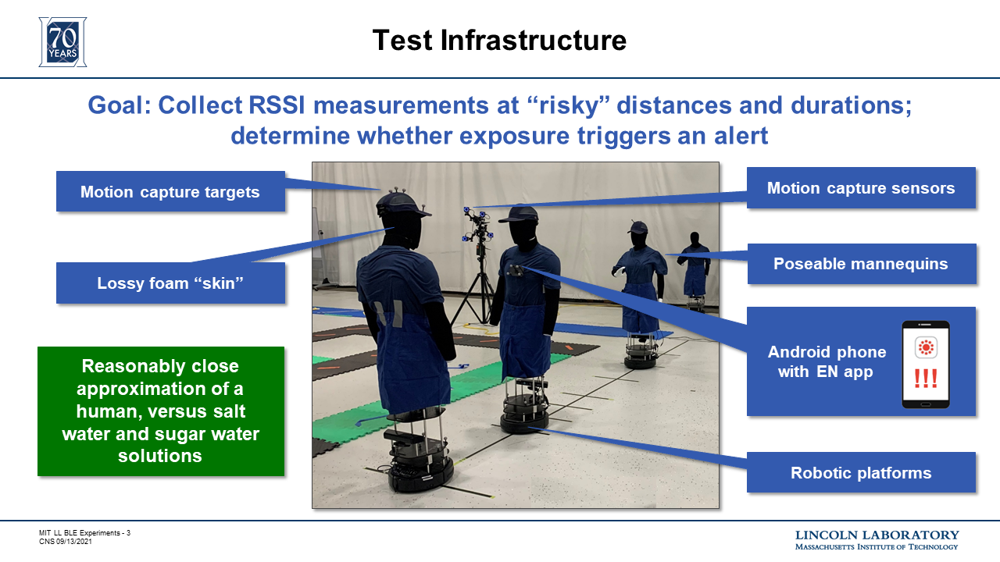
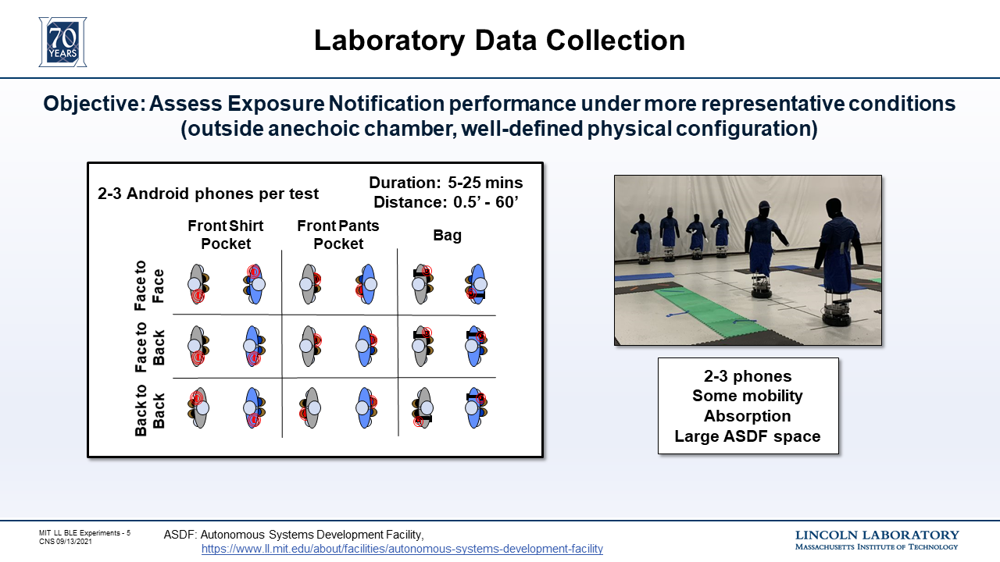
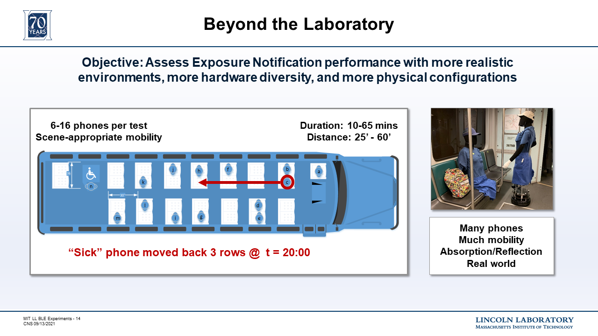
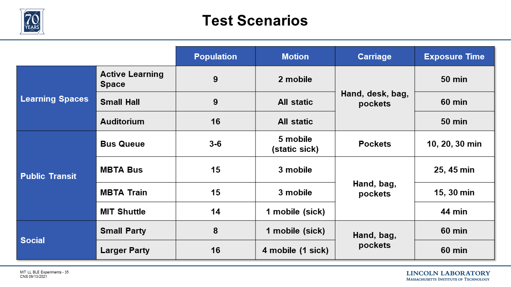
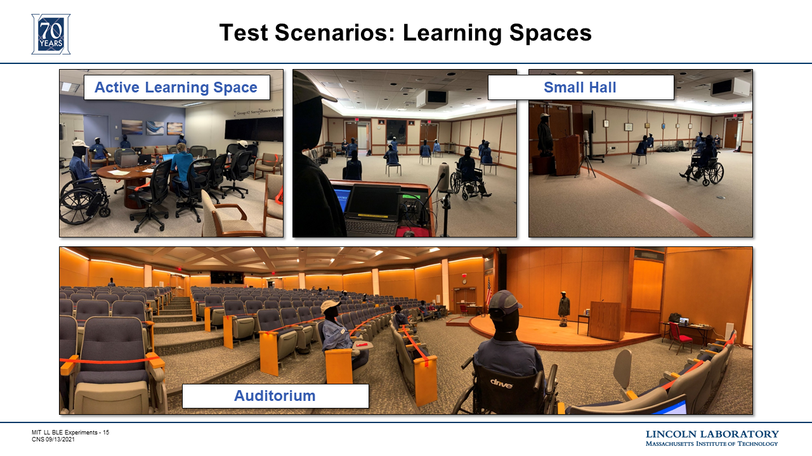
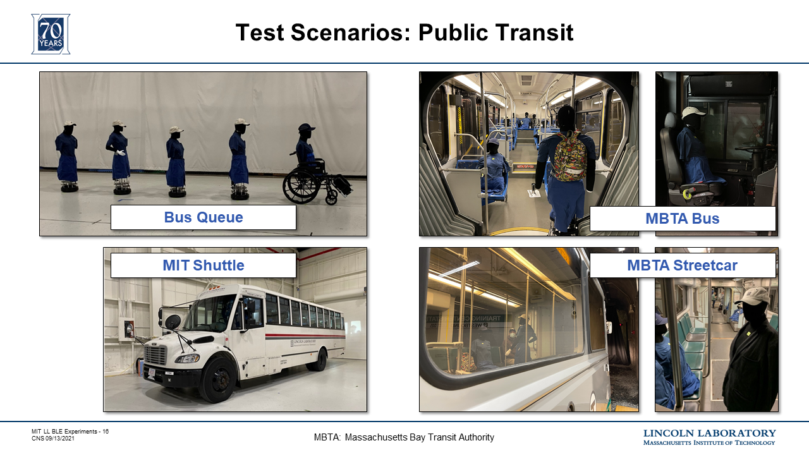

# Data Collection Visuals

## Test Infrastructure

Human-analogue robots were used for close interactions. In larger scenarios in the MITLL_UA data collections, humans also were included at greater distances, to increase the number of phones we could accommodate.

|  |
|:--:|
| **Figure 1: Test Infrastructure** |

## Testing 

|  |
|:--:|
| **Figure 2: MITLL Data Collection** |

|  |
|:--:|
| **Figure 3: MITLL_UA Data Collection** |

|  |
|:--:|
| **Figure 4: MITLL_UA Scenarios** |

|  |
|:--:|
| **Figure 5: Learning Spaces** |

|  |
|:--:|
| **Figure 6: Public Transit** |

|  |
|:--:|
| **Figure 7: Social** |

## Distribution Statement

DISTRIBUTION STATEMENT A. Approved for public release. Distribution is unlimited.

This material is based upon work supported under Air Force Contract No. FA8702-15-D-0001. Any opinions, findings, conclusions or recommendations expressed in this material are those of the author(s) and do not necessarily reflect the views of the U.S. Air Force.

© 2021 Massachusetts Institute of Technology.

Delivered to the U.S. Government with Unlimited Rights, as defined in DFARS Part 252.227-7013 or 7014 (Feb 2014). Notwithstanding any copyright notice, U.S. Government rights in this work are defined by DFARS 252.227-7013 or DFARS 252.227-7014 as detailed above. Use of this work other than as specifically authorized by the U.S. Government may violate any copyrights that exist in this work.
